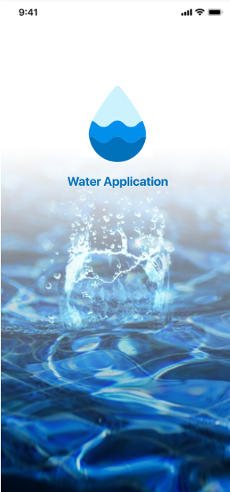
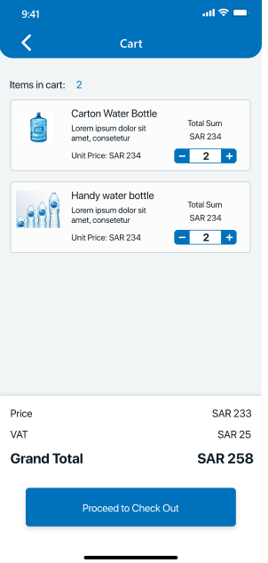
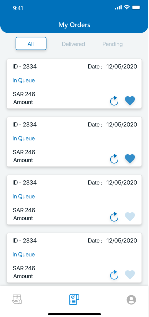

# Water-Delivery
INTRODUCTION

In Saudi Arabia there are different mineral water companies that
deliver water at the people’s doorstep. Through this application
people can register themselves and set the time at which they
want water delivery, weekly or monthly etc. So that companies
can keep the track and deliver water accordingly.

KEY FEATURES:

1. Order Delivery Request 
2. Online Payment Options 
3. Delivery Expert Panel of Water Delivery Software-
4. Push Notifications on the Company side
5. View Order History
6. Request Payment from Admin
7. Manage all the Users 
8. Dashboard
9. Manage User Payment
10. Manage Reviews and Feedback

TECHNOLOGIES & TOOLS USED
1. Flutter
3. .NET
4. SQL Database
5. FCM
6. Payment Gateway

SCREENSHOTS

            
